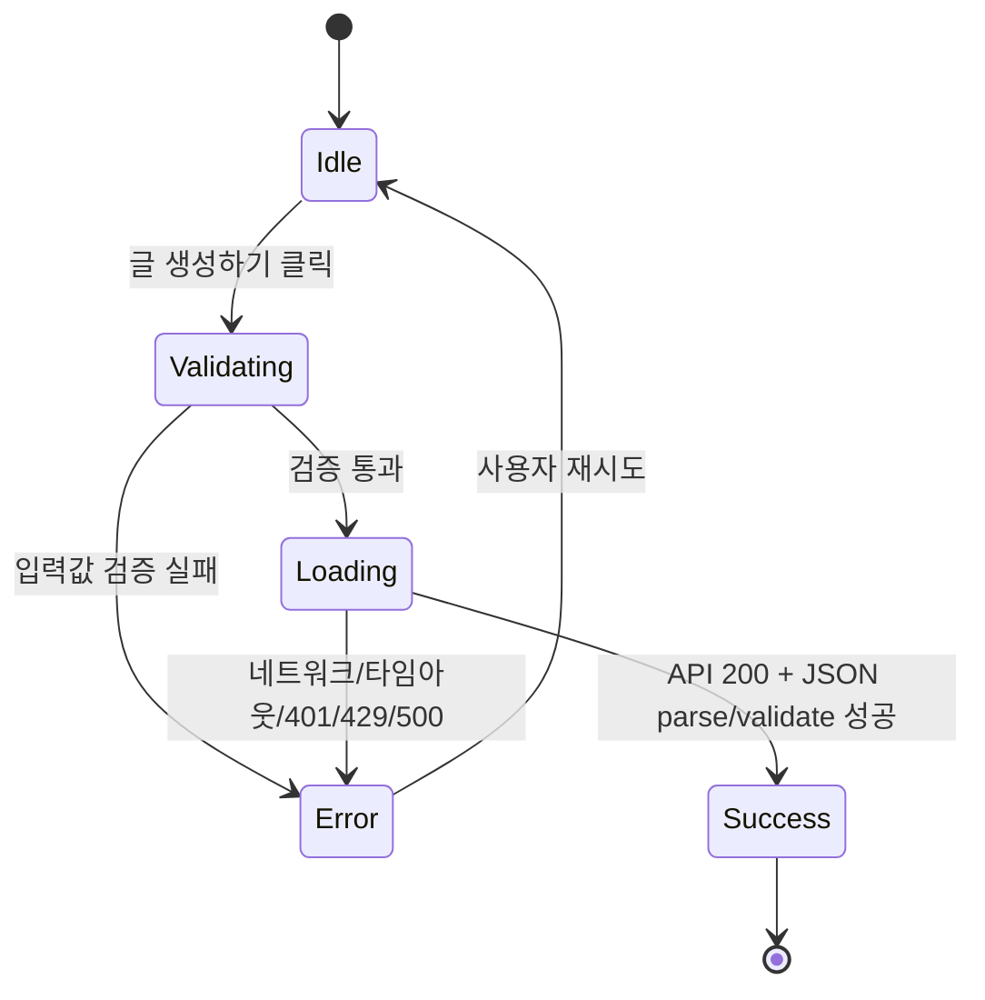

# CodeLog 기획 보완안 (피드백 반영)

## 1) 템플릿별 시스템 프롬프트 + API JSON 명세

### 1-1. API Endpoint
- Method: `POST`
- URL: `/api/generate`
- Content-Type: `application/json`

### 1-2. 요청 JSON (Request)
```json
{
  "topic": "React useState 훅 사용법",
  "keywords": ["React", "useState", "상태관리"],
  "style": "tutorial",
  "language": "ko",
  "tone": "professional",
  "length": "medium",
  "includeCode": true
}
```

### 1-3. 응답 JSON (Response)
```json
{
  "title": "React useState 완전 정복: 상태 관리의 시작",
  "content": "## 개요\n...\n## 마무리\n...",
  "hashtags": ["React", "useState", "상태관리"],
  "metaDescription": "React useState 훅의 기본부터 실무 패턴까지 코드 예시로 설명합니다."
}
```

### 1-4. 템플릿별 목차 규칙
- `tutorial`
  - `## 개요`
  - `## 사전 준비`
  - `## Step 1`
  - `## Step 2`
  - `## Step 3`
  - `## 마무리`
- `til`
  - `## 오늘 배운 것`
  - `## 상세 내용`
  - `## 어려웠던 점`
  - `## 느낀 점`
- `troubleshooting`
  - `## 문제 상황`
  - `## 원인 분석`
  - `## 해결 방법`
  - `## 결론`

### 1-5. 프롬프트 강제 규칙 (핵심)
- 섹션 제목/순서 고정, 추가 섹션 금지
- `includeCode=true`면 코드 블록 최소 2개
- 각 섹션 최소 2문단 이상
- 키워드 분산 반영
- JSON 이외 텍스트 출력 금지

### 1-6. 서버 보정 로직
- 1차 생성 후 섹션 정합성 검사
- 템플릿 목차 불일치 시, 편집 프롬프트로 1회 자동 재구성
- 재구성 결과가 정합하면 교체 적용

---

## 2) 상태 관리 플로우 (대기 -> 로딩 -> 성공 -> 에러)



### UI 표시 정책
- `Idle`: 버튼 활성화
- `Loading`: 버튼 비활성화 + 점 로더 표시
- `Success`: 결과 페이지 이동
- `Error`: 상단 중앙 `Toast` 노출 (`destructive`)

---

## 3) 유효성 검사 기준 (엣지 케이스 포함)

### 3-1. 클라이언트 사전 검증
- `topic`
  - 필수
  - 길이 `2~120`
  - 글자/숫자 최소 1개 포함
- `keywords`
  - 개수 `1~15`
  - 각 항목 길이 `<= 40`
  - 빈 문자열 제거 후 검사
- 요청 타임아웃: `30초` (`AbortController`)

### 3-2. 서버 검증 (Zod)
- `topic`: `min(2), max(120)`
- `keywords`: `array(string min 1 max 40).max(15)`
- `style`: `tutorial | til | troubleshooting`
- `language`: `ko | en`
- `tone`: `professional | casual | friendly`
- `length`: `short | medium | long`
- `includeCode`: `boolean`

### 3-3. 특수문자 정책
- 일반 특수문자 입력은 허용
- 단, 주제는 의미 있는 텍스트(문자/숫자 포함) 필수
- 악의적 제어문자/빈 값은 클라이언트/서버 검증에서 차단

---

## 4) 예외 처리 및 에러 UX 정의

| 상황 | 감지 레이어 | 사용자 메시지 | UI |
|---|---|---|---|
| 주제 미입력 | 클라이언트 | 주제를 입력해주세요 | Toast |
| 주제 길이 초과/미달 | 클라이언트 | 주제는 2자 이상 120자 이하 | Toast |
| 키워드 개수/길이 위반 | 클라이언트 | 키워드 규칙 안내 | Toast |
| 요청 30초 초과 | 클라이언트 | 요청 시간이 초과되었습니다 | Toast |
| API Key 누락/오류(401) | 서버 | API 키가 올바르지 않거나 설정되지 않았습니다 | Toast |
| quota 초과(429) | 서버 | 요청 한도를 초과했습니다 | Toast |
| 기타 서버 오류(500) | 서버 | 글 생성에 실패했습니다 | Toast |

---

## 5) 증빙 포인트 (팩트 체크용)

- 검증 스키마: `src/lib/validation.ts`
- 프롬프트/템플릿: `src/services/prompt/templates.ts`
- 생성/재구성 로직: `src/services/ai/generateBlog.ts`
- API 에러 매핑: `src/app/api/generate/route.ts`
- 토스트 UI: `src/components/ui/toaster.tsx`, `src/components/ui/toast.tsx`
- 생성 화면 에러 처리: `src/components/screens/generate-screen.tsx`
